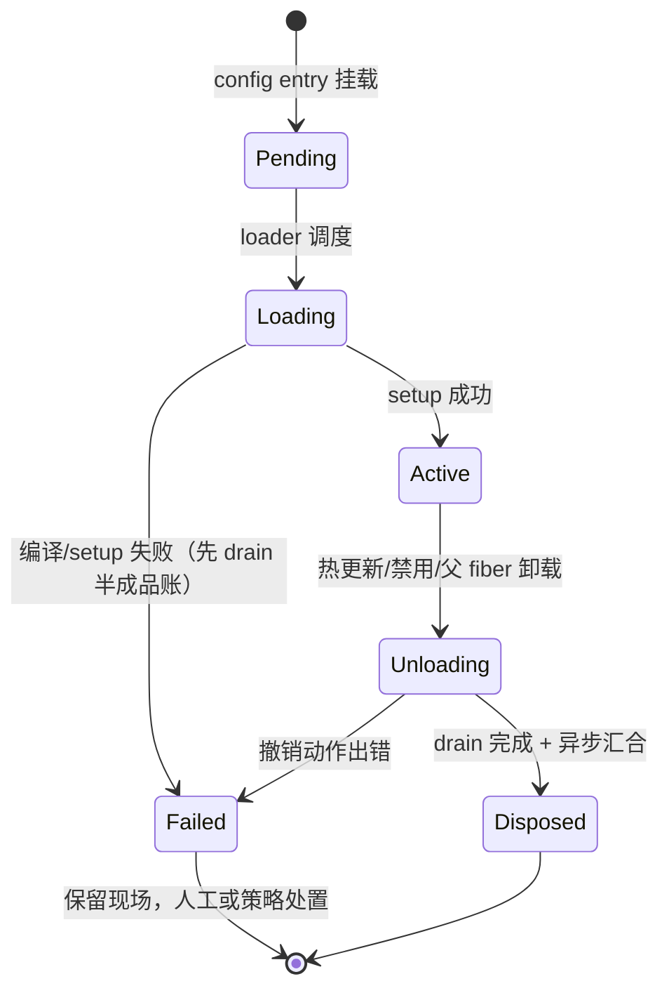

# Metis — Fiber 设计

> 状态：核心已定（§8 四点 ✅ + §9 ✅ = [ADR-0019](../decisions/0019-crate-layout.md) + §10 ✅ = [ADR-0023](../decisions/0023-core-restart-semantics.md)）。
> 2026-09-29 定稿；2026-10-02 §9 闭环（ADR-0019）；2026-10-03 §10 核心重启语义（ADR-0023）。机制调研依据：`docs/research/cordis-research.md`；决策登记：[ADR-0010](../decisions/0010-fiber-core.md)。

---

## 0. 术语：Fiber ≠ 并发原语

"Fiber"在并发领域指绿色线程/协程，**此处无关**。Metis 的 Fiber（继承 Cordis）是**插件实例的生命周期容器**：账本 + 档案夹。它只回答三个问题：这个插件活着吗、干过什么、怎么干净地死。并发执行归 tokio，Fiber 不是执行体。

## 1. 核心机制：effect 与 disposer

- 插件运行即产生**副作用（effect）**：监听事件、暴露服务、起定时器、挂子插件……
- 热更新 = 旧实例彻底消失 + 新实例干净启动；残留副作用 = 新旧并存、行为不可复现（论文的 temporal composability）
- 铁律：**每次注册副作用必须同时返回撤销动作（disposer）**；Fiber 是该实例名下全部 disposer 的账本；卸载 = 逐页结清

## 2. Disposer 四条规矩

1. **LIFO 逆序结算**：后注册先撤销（后产生的效应往往依赖先产生的）
2. **幂等**：Rust 结构性保证——`FnOnce` 类型只能调一次 + 状态机保证 Unloading 只进入一次 → 双重 drain 不可能（比 Cordis 运行期 once 守卫更硬）
3. **异步可汇合**：撤销可异步（关连接、flush）；卸载完成 = 全部汇合（JoinSet）
4. **结算期拒绝新账**：进入 Unloading 后禁止注册新 effect

## 3. 状态机



- **Loading 失败也要 drain 已记账的 disposer**（半成品清理）→ 正常卸载与失败善后复用同一份 drain 逻辑
- 插件内任何错误不得炸穿 runtime；唯一上抛通道 `fiber.await()`

## 4. Arena + SlotMap

- 所有 fiber 由 runtime 的 arena 集中拥有，外界只持 **FiberId**（`(槽位, 世代号)`）
- SlotMap 世代键：槽位复用后世代 +1，旧 ID 自动失效——热更新场景下旧 fiber 的 ID 满天飞（依赖边、订阅表、父子表），必须防 ABA

## 5. epoch 依赖指纹（[ADR-0001](../decisions/0001-inject-runtime-checks.md) 具体化）

1. 每个 service key 一个 epoch 计数器；提供方注册时 epoch=N
2. 消费者 inject 成功时记录指纹 `(key, epoch)`
3. 提供方热更新 → 重注册 → epoch+1
4. 指纹过期 → 消费者也必须重启；顺序：**先卸消费者，再卸提供方；加载反向**
5. 反向索引 `service → dependents` 避免全表扫描

依赖热替换 = 完整 unload→reload，不做就地修补：保守但可推理（面向 Kani/Lean 的性质）。

## 6. 错误遏制三层

| 层   | 机制                                                                                   |
| ---- | -------------------------------------------------------------------------------------- |
| Luau | 插件代码跑在 pcall 语义内，Lua 错误不过 FFI                                            |
| VM   | 每实例独立 `lua_State`（[ADR-0005](../decisions/0005-vm-topology.md)），内存炸只炸自己 |
| Rust | 插件调用一律 `Result`；异步任务 panic 由 JoinHandle 捕获 → `Failed(Report)`            |

## 7. Rust 数据结构草案（示意，非最终实现）

```rust
slotmap::new_key_type! { pub struct FiberId; }

pub enum FiberState {
    Pending,
    Loading,
    Active,
    Unloading,
    Disposed,
    Failed(Report),          // 错误报告随状态携带
}

pub struct Fiber {
    state: FiberState,
    disposers: IndexMap<u64, Disposer>,   // 账本：保序，反向 drain = LIFO
    config: serde_yml::Value,             // 本实例已校验配置
    fingerprints: Vec<(ServiceKey, u64)>, // inject 时的 (key, epoch)
    parent: Option<FiberId>,
    children: Vec<FiberId>,
    // vm 句柄、事件订阅登记等运行期附件
}

// 统一异步签名；同步撤销包成立即完成的 future
type Disposer = Box<dyn FnOnce() -> BoxFuture<'static, ()> + Send>;
```

## 8. 已定决策

| # | 决策                                                                                              | 状态 |
| - | ------------------------------------------------------------------------------------------------- | ---- |
| 1 | 状态机用 **enum 带数据**（Rust 惯例），不用 typestate                                             | ✅   |
| 2 | **fiber ≠ task**：只记账+协调；异步清理 JoinSet 汇合                                              | ✅   |
| 3 | Disposer **统一异步签名**                                                                         | ✅   |
| 4 | **子 fiber = 父的一笔 effect**（子的卸载函数记进父账）→ LIFO 自动保证父死先死子，无单独树遍历通道 | ✅   |

## 9. fiber-core 纯 crate 切法（已定 ✅ = [ADR-0019](../decisions/0019-crate-layout.md)）

5. 纯核心 = 不碰 tokio/mlua 的纯函数核心（状态机/账本 LIFO/epoch 指纹/失效闭包），返回动作描述由胶水解释执行；crate 物理分离（`metis-fiber-core`），仅允许纯数据依赖（slotmap/indexmap/thiserror 级）、不用 tracing；keyed diff 归独立纯 crate `metis-loader`。边界明细与被淘汰选项见 ADR-0019。

## 10. 核心重启与插件语义（已定 ✅ = [ADR-0023](../decisions/0023-core-restart-semantics.md)）

核心自身更新 = 进程级干净重启。插件侧**不引入重启专有钩子**，全程复用现有生命周期：

- **关闭 = 全量 unload**：复用 drain 路径——LIFO 结账、优雅执行（disposer 可 await 在途持久化）、超时强制、依赖者先卸（与单次卸载同一契约，见 §2/§3 与 [ADR-0018](../decisions/0018-service-registry.md) S4）
- **启动 = 全量 load**：复用启动路径——loader 挂载 entry + 激活门 + Pending 解析（与 [ADR-0018](../decisions/0018-service-registry.md) "恢复路径 = 启动路径复用"同一条筋）
- 插件不区分"为核心重启卸载"与"为热更新卸载"——同一清理契约

派生待办（登记不决）：

- **跨重启状态政策**：进程死则 VM 全灭——什么状态落盘活下来（落盘 seam 原子写）、agent 自身连续性（进行中的对话、待审批）如何恢复，与 journal/replay 设计强耦合
- **优雅关闭细则**：in-flight 服务调用与邮箱残留处置已定（2026-10-09 [luau-abi](luau-abi.md) §A4.5：四段时序关闸→优雅窗口→强杀→drain；对手方即 `Err(Unavailable)`、残留丢弃）；SIGTERM 处理、drain 总预算数值 = 实现期议题
